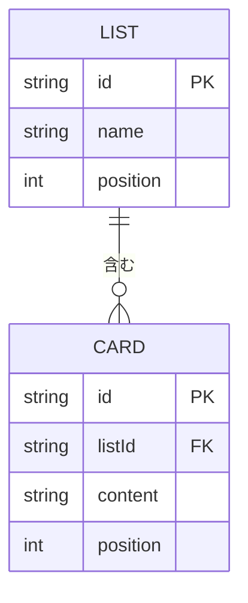

# ER図 - Trello風タスクボード

[← 要件定義書（README）に戻る](../README.md)

localStorageに保存するデータの論理モデルです（DBのテーブル設計ではありません）。

## ER図



- 1つのリストは0件以上のカードを持つ。
- カードは必ず1つのリストに所属する。

## 項目と要件定義書の対応

| エンティティ | 項目 | 説明 | 制約 | 関連する要件 |
|---|---|---|---|---|
| List | id | リストの識別子 | 一意 | [機能8 保存](../README.md#func-8) |
| List | name | リスト名 | 編集可能 | [機能1 リストの追加](../README.md#func-1) / [機能2 名前編集](../README.md#func-2) |
| List | position | リストの並び順 | 整数 | [機能1 リストの追加](../README.md#func-1) |
| Card | id | カードの識別子 | 一意 | [機能8 保存](../README.md#func-8) |
| Card | listId | 所属リストのid | Listのidを参照。リスト削除時にカードも削除 | [機能3 リストの削除](../README.md#func-3) / [ユースケース3](../README.md#uc-3) / [機能7 別リストへ移動](../README.md#func-7) |
| Card | content | カードの内容 | 空文字不可 | [機能4 カードの追加](../README.md#func-4) / [機能5 内容編集](../README.md#func-5) / [ユースケース1](../README.md#uc-1) |
| Card | position | リスト内の並び順 | 整数。D&Dで更新 | [機能7 D&D並び替え](../README.md#func-7) / [ユースケース2](../README.md#uc-2) |
| （カード削除） | - | カードのレコードを削除 | - | [機能6 カードの削除](../README.md#func-6) |

## localStorageの保存イメージ

キー例: `trello-board`

```json
{
  "lists": [
    { "id": "l1", "name": "ToDo", "position": 0 },
    { "id": "l2", "name": "進行中", "position": 1 }
  ],
  "cards": [
    { "id": "c1", "listId": "l1", "content": "カードA", "position": 0 },
    { "id": "c2", "listId": "l1", "content": "カードB", "position": 1 },
    { "id": "c3", "listId": "l2", "content": "カードC", "position": 0 }
  ]
}
```

関連: [機能8 データの永続化](../README.md#func-8) / [非機能要件](../README.md#非機能要件)
