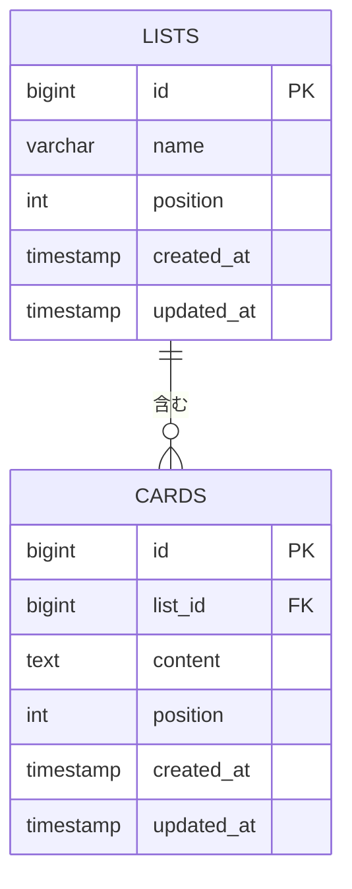

# ER図 - Trello風タスクボード

[← 要件定義書（README）に戻る](../README.md)

PostgreSQLに保存するデータのテーブル設計です。

## ER図

- 1つのリストは0件以上のカードを持つ。
- カードは必ず1つのリストに所属する。
- リストを削除すると、そのリストのカードもすべて削除される（`ON DELETE CASCADE`）。

## 項目と要件定義書の対応

### lists（リスト）テーブル

| 項目 | 型 | 説明 | 制約 | 関連する要件 |
|---|---|---|---|---|
| id | BIGSERIAL | リストの識別子（自動で連番） | 主キー | [機能8 保存](../README.md#func-8) |
| name | VARCHAR(100) | リスト名 | 必須（空文字不可） | [機能1 リストの追加](../README.md#func-1) / [機能2 名前編集](../README.md#func-2) |
| position | INTEGER | リストの並び順 | 必須 | [機能1 リストの追加](../README.md#func-1) |
| created_at | TIMESTAMP | 作成日時 | 必須（自動で記録） | [機能8 保存](../README.md#func-8) |
| updated_at | TIMESTAMP | 更新日時 | 必須（自動で記録） | [機能2 名前編集](../README.md#func-2) |

### cards（カード）テーブル

| 項目 | 型 | 説明 | 制約 | 関連する要件 |
|---|---|---|---|---|
| id | BIGSERIAL | カードの識別子（自動で連番） | 主キー | [機能8 保存](../README.md#func-8) |
| list_id | BIGINT | 所属リストのid | 必須。lists.id を参照（外部キー）。リスト削除時にカードも削除 | [機能3 リストの削除](../README.md#func-3) / [ユースケース3](../README.md#uc-3) / [機能7 別リストへ移動](../README.md#func-7) |
| content | TEXT | カードの内容 | 必須（空文字不可） | [機能4 カードの追加](../README.md#func-4) / [機能5 内容編集](../README.md#func-5) / [ユースケース1](../README.md#uc-1) |
| position | INTEGER | リスト内の並び順 | 必須。D&Dで更新 | [機能7 D&D並び替え](../README.md#func-7) / [ユースケース2](../README.md#uc-2) |
| created_at | TIMESTAMP | 作成日時 | 必須（自動で記録） | [機能4 カードの追加](../README.md#func-4) |
| updated_at | TIMESTAMP | 更新日時 | 必須（自動で記録） | [機能5 内容編集](../README.md#func-5) / [機能7 D&D並び替え](../README.md#func-7) |

カードの削除（[機能6](../README.md#func-6)）は、cards テーブルから該当する行を削除する。

## データの保存イメージ

テーブルに保存されるデータの例です。

**lists**

| id | name | position |
|---|---|---|
| 1 | ToDo | 0 |
| 2 | 進行中 | 1 |

**cards**

| id | list_id | content | position |
|---|---|---|---|
| 1 | 1 | カードA | 0 |
| 2 | 1 | カードB | 1 |
| 3 | 2 | カードC | 0 |

（created_at / updated_at は省略）

関連: [機能8 データの永続化](../README.md#func-8) / [非機能要件](../README.md#非機能要件)
